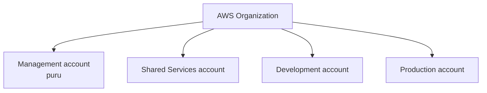

# AWS account structure

## Purpose

Document the current Project Crystal AWS account inventory and its intended account-level separation.

## Scope

This document records account names only. It does not infer account identifiers, OU membership, deployed services, or resource ownership.

## Current status

**Complete through Milestone 1.** Four accounts are present: Management, Shared Services, Development, and Production.

## Architecture

The Management account is named `puru`. No AWS account IDs are recorded in this repository. Shared Services, Development, and Production exist as separate accounts, but their deployed resource inventories are empty beyond the landing-zone configuration.

## Engineering notes

Account separation is established before application or platform services are introduced. Do not treat account names as an assertion of deployed shared services, development workloads, or production workloads.

## Validation

Validate that the four documented accounts appear in AWS Organizations and that access through IAM Identity Center matches the assigned permission set.

## Known limitations

The current inventory does not state which organizational unit contains each account. No account contains documented network, Kubernetes, data, observability, ECR, or CI/CD resources.

## References

- [Organization structure](organization-structure.md)
- [AWS account inventory](../docs/reference/aws-account-inventory.md)
- [Account access runbook](../docs/runbooks/account-access.md)

## Last reviewed

2026-07-27
