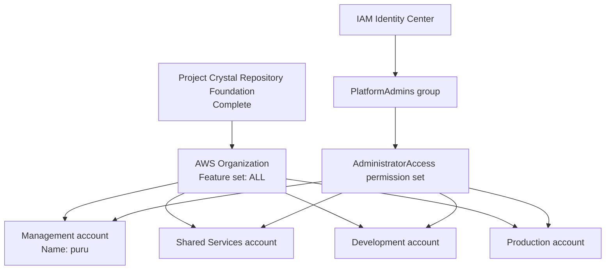

# Current architecture state

## Purpose

Provide the authoritative, implementation-neutral description of Project Crystal as deployed after Milestone 1.

## Scope

This document covers completed repository, landing-zone, organization, account, and IAM Identity Center work only. It does not describe planned infrastructure as deployed.

## Current status

Milestone 0 and Milestone 1 are complete. No milestone beyond the landing zone has been deployed.

## Architecture

The primary operating region is `ap-south-1`. Terraform uses local state only. The architecture has no secondary region.

## Engineering notes

The repository is ready to document and govern future work, but future platform domains remain explicitly unimplemented. Account-to-OU membership is not asserted because it is not part of the supplied current-state inventory.

## Validation

Current state is validated against the completed Milestone 1 inventory: Organization feature set, accounts, OUs, Identity Center group, permission set, assignments, and primary region.

## Known limitations

No networking, security services, management platform, ECR, Kubernetes, GitOps, data layer, observability, production hardening, CI/CD, or GitHub Actions are deployed.

## References

- [Landing zone](landing-zone.md)
- [Deployment status](../docs/reference/deployment-status.md)
- [Milestone 1](../docs/milestones/MILESTONE-1.md)

## Last reviewed

2026-07-27
