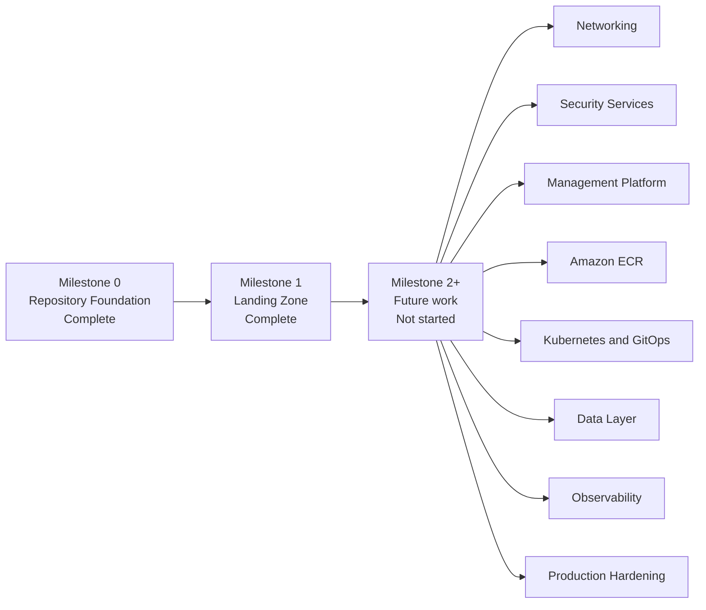

# Future roadmap architecture

## Purpose

Separate planned Project Crystal delivery domains from the currently deployed landing zone.

## Scope

This roadmap is a status boundary, not an implementation design. It documents only that the listed domains are future work.

## Current status

Milestone 2 onward is **not started**. Only Repository Foundation and Landing Zone work are complete.

## Architecture

## Engineering notes

Future domains must not be represented as deployed until validated and recorded in a completed milestone. Their sequence, design, and resource choices remain outside this document.

## Validation

Validation is the deployment-status inventory: only Milestone 0 and Milestone 1 completion are recorded.

## Known limitations

This roadmap does not authorize implementation and contains no target dates, configurations, resources, or deployment commitments.

## References

- [Deployment status](../docs/reference/deployment-status.md)
- [Current architecture state](current-state.md)
- [Milestone records](../docs/milestones/README.md)

## Last reviewed

2026-07-27
