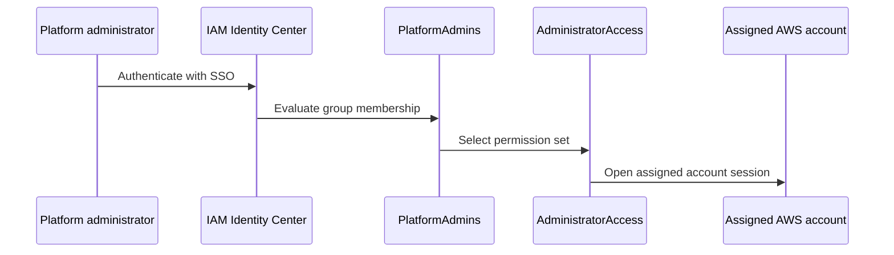

# IAM Identity Center architecture

## Purpose

Document the IAM Identity Center model currently used to authenticate and authorize Project Crystal platform administrators.

## Scope

Covers the configured identity source, group, permission set, and account assignments. It does not document users, SSO start URLs, MFA settings, or access beyond the supplied inventory.

## Current status

**Complete through Milestone 1.** IAM Identity Center provides the documented SSO access path.

## Architecture

IAM Identity Center is its own identity source. The `PlatformAdmins` group is assigned the `AdministratorAccess` permission set in Management, Shared Services, Development, and Production.

## Engineering notes

Use the group-and-permission-set model rather than undocumented direct access patterns. The repository intentionally does not store sign-in URLs, user identities, credentials, or session material.

## Validation

Validate the Identity Center identity source, `PlatformAdmins` group, `AdministratorAccess` permission set, and its four account assignments through authorized administration access.

## Known limitations

No additional groups, permission sets, delegated administration, or identity-provider integration are documented. No workload IAM design exists.

## References

- [AWS SSO login](../docs/runbooks/aws-sso-login.md)
- [AWS CLI profiles](../docs/runbooks/aws-cli-profiles.md)
- [Current environment](../docs/reference/current-environment.md)

## Last reviewed

2026-07-27
