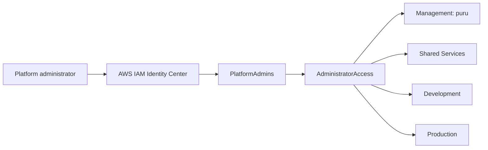

# Landing zone architecture

## Purpose

Describe the completed AWS Organizations and IAM Identity Center landing-zone baseline.

## Scope

Includes organization structure, account inventory, SSO access, and regional posture. It excludes all workload and network infrastructure.

## Current status

**Complete through Milestone 1.** No infrastructure beyond the landing zone exists.

## Architecture

The landing zone uses an AWS Organization with feature set `ALL`; its primary region is `ap-south-1` and it has no secondary region.

## Engineering notes

IAM Identity Center uses itself as the identity source. Access documented here is group-based through `PlatformAdmins`, not through individual-user assignments. Terraform state remains local by deliberate deferral of remote backend design.

## Validation

Validate Organization feature set, account presence, IAM Identity Center group and permission-set names, documented assignments, and primary region using approved console or CLI access.

## Known limitations

This landing zone has no VPC, security groups, EKS, RDS, Redis, ECR, GitOps, observability, CI/CD, or central management platform.

## References

- [Account structure](account-structure.md)
- [Identity Center](identity-center.md)
- [Terraform state strategy](../docs/standards/terraform-state-strategy.md)

## Last reviewed

2026-07-27
