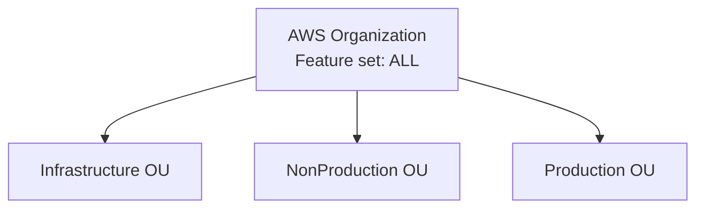

# AWS Organization structure

## Purpose

Record the current AWS Organization feature set and organizational-unit inventory.

## Scope

Includes only the Organization-level structure known to exist after Milestone 1. It does not define policies, account-to-OU placement, or resource architecture.

## Current status

**Complete through Milestone 1.** The Organization uses the `ALL` feature set.

## Architecture

The documented organizational units are Infrastructure, NonProduction, and Production. This diagram intentionally does not connect accounts to OUs because those memberships are not provided by the current inventory.

## Engineering notes

Organizational units are a governance boundary, not evidence of deployed networking, security services, workloads, or production hardening. Any future policy design requires separate documented review.

## Validation

Validate the Organization feature set and the existence of the three organizational units through AWS Organizations administration.

## Known limitations

No service control policies, account memberships, delegated administrators, or other organization controls are documented.

## References

- [AWS Organization reference](../docs/reference/aws-organization.md)
- [Account structure](account-structure.md)
- [AWS account strategy](../docs/standards/aws-account-strategy.md)

## Last reviewed

2026-07-27
