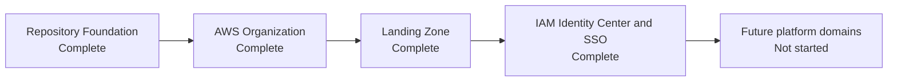

# Deployment status

## Purpose

Provide the authoritative delivery status boundary for Project Crystal.

## Scope

Lists completed and not-started platform domains only. It does not describe implementation plans or forecast delivery dates.

## Current status

Current project state is complete through Milestone 1: AWS Organizations and Landing Zone.

## Architecture

## Complete

| Capability | Status |
| --- | --- |
| Repository Foundation | Complete |
| AWS Organization | Complete |
| Landing Zone | Complete |
| IAM Identity Center | Complete |
| AWS Accounts | Complete |
| Permission Sets | Complete |
| SSO Access | Complete |

## Not started

| Capability | Status |
| --- | --- |
| Networking | Not started |
| Security Services | Not started |
| Management Platform | Not started |
| Amazon ECR | Not started |
| Kubernetes | Not started |
| GitOps | Not started |
| Data Layer | Not started |
| Observability | Not started |
| Production Hardening | Not started |

## Engineering notes

Do not treat a repository directory, roadmap item, or account name as evidence of deployment. Update a capability to complete only with validated completed-milestone evidence.

## Validation

The status is validated by Milestone 0 and Milestone 1 records and the current environment inventory.

## Known limitations

No implementation beyond the landing zone has been documented as deployed, including CI/CD and GitHub Actions.

## References

- [Milestone 0](../milestones/MILESTONE-0.md)
- [Milestone 1](../milestones/MILESTONE-1.md)
- [Future roadmap](../../architecture/future-roadmap.md)

## Last reviewed

2026-07-27
